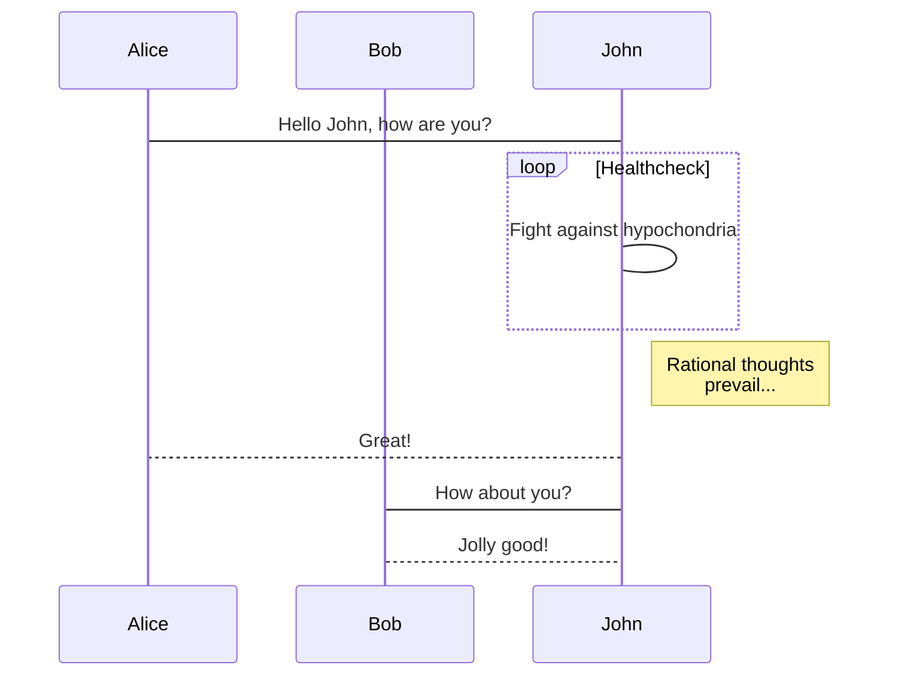

# 1233243423

## haha

* test
* 23457
* test1

1. hah
2. 123123
3. test

## 234

&copy;
AT&amp;T

4 < 5

> 12312
>
> 312312

    <table>
    <tr>
        <td>Foo</td>
    </tr>
    </table>

[foo]: http://example.com/  "Optional Title Here"
[foo]: http://example.com/  "Optional Title Here"
[foo]: http://example.com/  "Optional Title Here"

[google](http://google.com)

+ weqwe
+ sdasdqwe
+ sdasdqwe

\1231
\*123123*\

[x]  qwe

$f(x) = sin(x) + 100$

$$\sum_{n = 1}^{100}$$

<http://baodu.com>

1231 **hello**

***
`fun (x: Int, y: Int): Int {
  return x + y
}`

表头|条目一|条目二
:---:|:---:|:---:
项目|项目一|项目二

## hello1

*hello*  wqeqwe  
*123*  

[baidu](http://baidu.com)

> int m = 100  
> double n = 1000.0

---

'alert('hello word')'  


```ditaa {cmd=true args=["-E"]}
  +--------+   +-------+    +-------+
  |        | --+ ditaa +--> |       |
  |  Text  |   +-------+    |diagram|
  |Document|   |!magic!|    |       |
  |     {d}|   |       |    |       |
  +---+----+   +-------+    +-------+
      :                         ^
      |       Lots of work      |
      +-------------------------+
```




```flow
st=>start: Start:>http://www.google.com[blank]
e=>end:>http://www.google.com
op1=>operation: My Operation
sub1=>subroutine: My Subroutine
cond=>condition: Yes
or No?:>http://www.google.com
io=>inputoutput: catch something...
para=>parallel: parallel tasks

st->op1->cond
cond(yes)->io->e
cond(no)->para
para(path1, bottom)->sub1(right)->op1
para(path2, top)->op1
```

